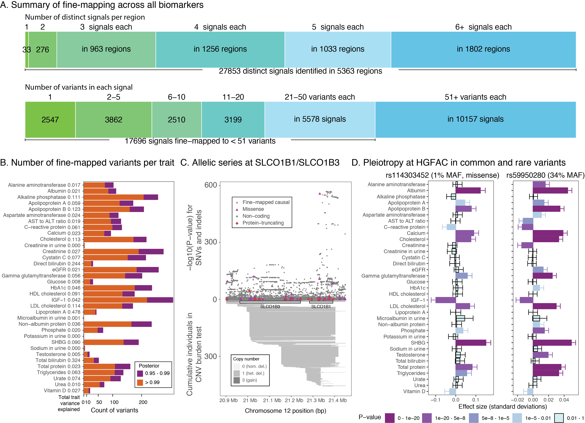

# Figures

## Fig. 1

**Figure 1.** Schematic overview of the study. We prepared a dataset of 35 serum and urine biomarkers from 363,228 individuals in UK Biobank. We analyzed the genetic basis of these biomarkers, assessed their relationship to medically relevant phenotypes, and generated predictive models of disease outcomes from genome-wide data.

## Fig. 2

**Figure 2.** Genetics of 35 biomarkers. (top left inset) Correlation of phenotypic (lower triangular matrix) and genetic (upper triangular matrix) effects plot between the 35 lab phenotypes, estimated using LD Score regression. The absolute heritability estimates with standard errors are in Supplementary Table 11A. (main panel) Fuji plot of lab phenotypes across the six categories provided by UK Biobank and genetic variant associations shown for LD independent variants with meta-analysis P < 5x10-9. Large-effect protein-truncating and protein-altering variants (labeled when abs(bBeta) >= 0.1 standard deviation [SD]) annotated with the category of association displayed (colored fill boxes) and highlighted if the loci was not previously reported in the comparison studies (Methods). Pleiotropic association and trait-specific association are shown by different sized circles. The p-values were from two-sided tests and were not corrected for multiple hypothesis testing. 

## Fig. 3

**Figure 3.** Summary of fine-mapped associations across 35 biomarker traits. (A) FINEMAP analysis summary. (top) The number of identified distinct association signals (color gradient from green to blue) in each region with at least one genome-wide significant (UK Biobank meta-analysis p < 5x10-9) association and the number of regions are shown, such as a single signal at 33 regions and two to forty signals at 5330 regions across 35 traits. (bottom) The number of identified candidate causal variants in the credible set with >= 99% posterior probability (color gradient from green to blue) and the number of signals are shown, such as 2547 signals were mapped to a single variant in the credible set across 35 traits. (B) Breakdown of the number of fine-mapped associations with posterior probability greater than 0.95 or 0.99 across all biomarkers. Orange, posterior greater than 0.99, green, posterior between 0.95 and 0.99. Total variance explained for each trait is shown and in Supplementary Table 14B. (C) Allelic series showing combined missense, non-coding, and rare copy number variants at the SLCO1B1/SLCO1B3 on total bilirubin levels. Copy number variants annotated below axis and SNPs and short indels annotated above axis. (D) Pleiotropic effects of fine-mapped rare coding (rs114303452, left) and common non-coding (rs59950280, right) variants at the HGFAC locus. Darker colors of purple indicate more significant associations. The p-values were from two-sided tests and were not corrected for multiple hypothesis testing. The error bars represent standard deviations.

## Fig. 4

**Figure 4.** Causal inference, transferability of polygenic risk scores, and complex trait association in polygenic risk tails. (A) Mendelian Randomization estimates causal links between biomarkers (blue nodes) and selected complex traits (red nodes). Association arrows are drawn based on effect direction (red decreasing, blue increasing). Associations were adjusted for FDR 5% cutoff across all tests (Methods). Edge width is proportional to the absolute causal effect size (log odds per standard deviation). A complete listing of discovered associations is provided in Supplementary Table 16. (B) Summary of prediction accuracy of the snpnet polygenic scores across traits, evaluated on a held out test set in White British as well as other 4 populations in UK Biobank. (C) (x-axis) Biomarker polygenic risk scores for the top 1%, top 10%, bottom 1%, and bottom 10% of individuals and their association to different diseases in UK Biobank, represented as the odds ratio of the disease in this group relative to the 40-60% quantiles. Traits without rows did not have any outcomes with FDR-adjusted significant associations.

## Fig. 5

**Figure 5.** Multiple regression with biomarker polygenic scores improve prevalent and incident disease prediction. (A) (x-axis) quantiles of polygenic risk score, spaced to linearly represent the mean of the corresponding bin of scores. (y-axis) Prevalence of chronic kidney disease (n = 2780 cases and n = 89409 total, defined by verbal questionnaire and hospital in-patient record ICD code data) within each quantile bin of the polygenic risk score. Error bars represent the standard error around each measurement, and individuals evaluated are held out European-ancestry individuals in UK Biobank.  (B) ROC curve with AUC for chronic kidney disease, comparing the snpnet-derived polygenic score to a multi-PRS model trained across biomarkers as well. Individuals evaluated are held out European-ancestry individuals in UK Biobank. (C) AUC-ROC estimates for prediction of 10 disease outcomes in a held-out test set of the UK Biobank. Diabetes was run using both a strict definition (excluding from control individuals with HbA1c < 39) and the complete sample (Methods). (D) Hazard ratios for the incidence of type 2 diabetes (n = 17,519), chronic kidney disease (n=3,058), myocardial infarction (n=7,913), heart failure (n = 13,965), gout (n = 1,936), gallstones (n = 11,629), and cirrhosis (n=845) in FinnGen using the standard single-disease PRS trained on UK Biobank using snpnet versus the multi-PRS including both biomarker PRSs and the trait PRS. The strict definition of type 2 diabetes is shown. Error bars represent 95% confidence intervals and points represent mean hazard ratio estimates.

## [`Supplementary Figures`](Supplementary_Figures)
